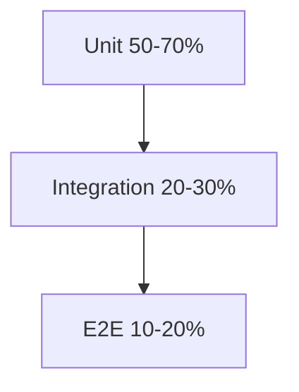

# Development

> **Status**: `CURRENT`  
> **Last Updated**: 2026-04-26  
> **Technical Debt**: None known

---

## Table of Contents

- [Overview](#overview)
- [Requirements](#requirements)
- [Installation](#installation)
- [Development Workflow](#development-workflow)
- [Testing](#testing)
- [Linting & Formatting](#linting--formatting)
- [Production Build](#production-build)
- [Appendix](#appendix)

---

## Overview

**MioFrame** is a modern, component-first Vue 3 application built with Vite and TypeScript. The project emphasizes:

- **CRDT-backed state management** using Automerge for conflict-free collaboration
- **Mobile-first design** following Material 3 guidelines
- **Type-safe development** with strict TypeScript configuration
- **Comprehensive testing** with unit, mutation, and E2E coverage
- **Performance optimization** for low-end devices and large datasets

### Tech Stack

| Layer      | Technology          | Version                          |
| ---------- | ------------------- | -------------------------------- |
| Framework  | Vue 3.5+            | Reactive UI rendering            |
| Build Tool | Vite 7+             | Fast HMR and production builds   |
| Language   | TypeScript 5.9+     | Static type checking             |
| State      | Automerge 2.5+      | CRDT-based collaborative editing |
| Router     | Vue Router 5        | Application routing              |
| HTTP       | ky 1.x              | Lightweight fetch wrapper        |
| Testing    | Vitest + Playwright | Unit + E2E testing               |
| Linting    | oxlint + ESLint 10+ | Code quality enforcement         |
| Formatting | oxfmt               | Consistent code formatting       |

---

## Requirements

### System Requirements

| Component | Minimum Version | Notes                        |
| --------- | --------------- | ---------------------------- |
| Node.js   | 20.x            | Required by TypeScript 5.9.3 |
| pnpm      | 10.x            | Project lockfile format      |
| Git       | 2.x             | Required for hooks setup     |
| Browser   | Chrome 120+     | E2E testing baseline         |

---

## Installation

### 1. Clone and Install

```bash
git clone https://github.com/Vyachean/beaver.git
cd beaver
pnpm install
```

> **Note**: Git hooks are installed via the `prepare` script. If this fails, run `pnpm run setup:git-hooks` manually.

### 2. Verify Installation

```bash
pnpm type-check   # Should pass
pnpm lint         # Should pass
pnpm format --check  # Should pass
```

---

## Development Workflow

### Development Server

```bash
pnpm dev
```

**Behavior**:

- HTTPS via `@vitejs/plugin-basic-ssl`
- Default URL: `https://127.0.0.1:5173`
- HMR enabled for all files
- Source maps generated

### Code Quality Gates

Before committing:

```bash
# Auto-fix
pnpm lint && pnpm format

# Verify
pnpm lint && pnpm format --check
```

### Commit Messages

Follow [Conventional Commits](https://www.conventionalcommits.org/):

```
<type>(<scope>): <description>

Types: feat, fix, docs, refactor, test, chore
```

---

## Testing

### Test Strategy



### Unit & Integration Tests (Vitest)

**Scope**: Internal logic, services, composables, schemas.

```bash
# Watch mode (default)
pnpm test

# Single run
pnpm test:run

# With coverage
pnpm test:coverage
```

**Configuration**: [`vitest.config.ts`](./vitest.config.ts)

**Coverage Goal**: Minimum 80% line coverage.

### Mutation Testing (StrykerJS)

**Purpose**: Verify test quality by introducing mutations.

**Scope**: Auto-derived from `*.test.ts`, excludes `src/shared/ui`.

```bash
# Full mutation test
pnpm test:mutate

# Dry run
pnpm exec stryker run --dryRunOnly

# Narrow scope
pnpm exec stryker run -m "src/shared/lib/**/*.ts"
```

**Thresholds**: High 80%, Low 60%

### E2E Tests (Playwright)

**Scope**: Browser smoke and end-to-end flows through the UI.

```bash
# Install browsers (once)
pnpm e2e:install

# Headless (default)
pnpm e2e

# With UI runner
pnpm e2e:ui

# Headed mode
pnpm e2e:headed
```

**Configuration**: [`playwright.config.ts`](./playwright.config.ts)

**Test Configuration**:

- Base URL: dynamic local preview URL, or `PLAYWRIGHT_EXTERNAL_BASE_URL` when provided
- Browsers: Desktop Chrome + Mobile Chrome (Pixel 5)
- Retries: 0 locally, 2 on CI

---

## Linting & Formatting

### Tools

| Tool     | Purpose                        | Config              |
| -------- | ------------------------------ | ------------------- |
| `oxlint` | Fast linting, TypeScript-aware | `oxlintrc.json`     |
| `eslint` | Rule enforcement               | `eslint.config.mjs` |
| `oxfmt`  | Consistent formatting          | Built-in defaults   |

### Commands

```bash
# Full pipeline
pnpm lint

# Individual tools
pnpm lint:oxlint
pnpm lint:eslint

# Formatting
pnpm format

# Format with validation
pnpm format --check
```

### Best Practices

1. **Auto-fix on commit**: Hooks run `lint` and `format` automatically
2. **Targeted runs**: Use `pnpm exec <tool> --fix <path>` for specific files
3. **CI gates**: Linting fails on CI if errors exist

---

## Production Build

### Build Commands

```bash
# Production build
pnpm build

# Preview production build
pnpm preview
```

### Build Output

**Location**: `dist/`

**Contents**:

- Optimized JavaScript bundles
- Minified CSS
- Pre-rendered HTML (PWA support)
- Source maps (development builds only)

### Deployment Notes

1. **HTTPS required**: All features expect secure context
2. **CORS**: Configure for production API endpoints
3. **Service Workers**: Pre-cache strategy configured in PWA plugin

---

## Appendix

### Command Reference

| Command              | Description              |
| -------------------- | ------------------------ |
| `pnpm dev`           | Start development server |
| `pnpm build`         | Production build         |
| `pnpm preview`       | Preview production build |
| `pnpm test`          | Vitest watch mode        |
| `pnpm test:run`      | Single-run test          |
| `pnpm test:coverage` | Test with coverage       |
| `pnpm test:mutate`   | Mutation testing         |
| `pnpm e2e`           | E2E tests (headless)     |
| `pnpm e2e:ui`        | E2E with UI runner       |
| `pnpm lint`          | Full lint pipeline       |
| `pnpm format`        | Format all files         |
| `pnpm type-check`    | TypeScript type checking |

### Configuration Files

| File                   | Purpose                        |
| ---------------------- | ------------------------------ |
| `vite.config.ts`       | Build configuration            |
| `vitest.config.ts`     | Test configuration             |
| `playwright.config.ts` | E2E test configuration         |
| `stryker.config.mjs`   | Mutation testing configuration |
| `eslint.config.mjs`    | ESLint configuration           |
| `tsconfig.json`        | TypeScript configuration       |

---

## References

- [Vue 3 Documentation](https://vuejs.org/)
- [Vite Documentation](https://vitejs.dev/)
- [Automerge Documentation](https://automerge.org/)
- [Playwright Documentation](https://playwright.dev/)
- [StrykerJS Documentation](https://stryker-mutator.io/)
- [Conventional Commits](https://www.conventionalcommits.org/)

---

_Document maintained as part of project infrastructure. Updates should be reviewed alongside architectural changes._
