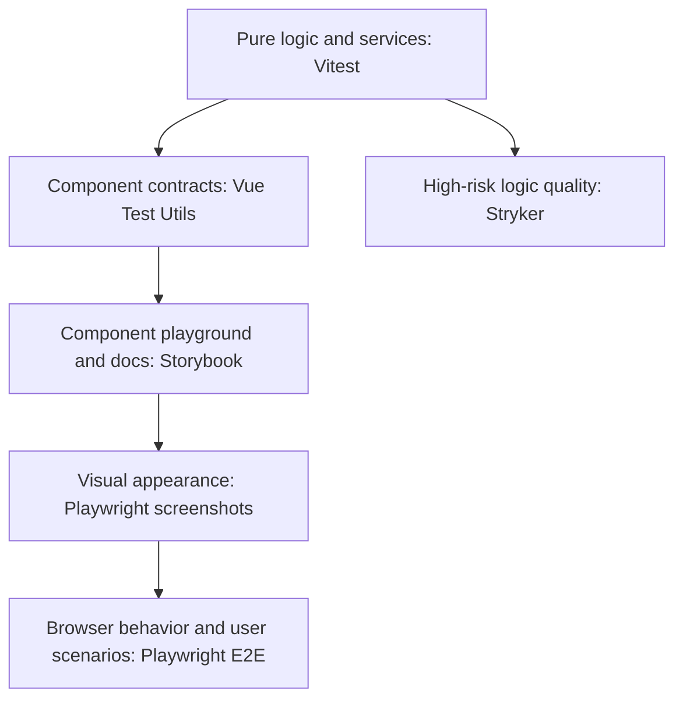

# Development

> **Status**: `CURRENT`  
> **Last Updated**: 2026-05-11  
> **Technical Debt**: None known

---

## Table of Contents

- [Overview](#overview)
- [Requirements](#requirements)
- [Installation](#installation)
- [Development Workflow](#development-workflow)
- [Testing](#testing)
- [Linting & Formatting](#linting--formatting)
- [Production Build](#production-build)
- [Appendix](#appendix)

---

## Overview

**MioFrame** is a modern, component-first Vue 3 application built with Vite and TypeScript. The project emphasizes:

- **CRDT-backed state management** using Automerge for conflict-free collaboration
- **Mobile-first design** following Material 3 guidelines
- **Type-safe development** with strict TypeScript configuration
- **Focused testing** with unit, component contract, visual regression, mutation, and E2E coverage
- **Performance optimization** for low-end devices and large datasets

### Tech Stack

| Layer      | Technology                           | Purpose                               |
| ---------- | ------------------------------------ | ------------------------------------- |
| Framework  | Vue 3.5+                             | Reactive UI rendering                 |
| Build Tool | Vite 7+                              | Fast HMR and production builds        |
| Language   | TypeScript 5.9+                      | Static type checking                  |
| State      | Automerge 2.5+                       | CRDT-based collaborative editing      |
| Router     | Vue Router 5                         | Application routing                   |
| HTTP       | ky 1.x                               | Lightweight fetch wrapper             |
| Testing    | Vitest + Vue Test Utils + Playwright | Unit, component contract, E2E, visual |
| Mutation   | StrykerJS                            | Test quality checks                   |
| Linting    | oxlint + ESLint 10+                  | Code quality enforcement              |
| Formatting | oxfmt                                | Consistent code formatting            |

---

## Requirements

### System Requirements

| Component | Minimum Version | Notes                    |
| --------- | --------------- | ------------------------ |
| Node.js   | 24.x            | CI and tooling baseline  |
| pnpm      | 10.x            | Project lockfile format  |
| Git       | 2.x             | Required for hooks setup |
| Browser   | Chrome 120+     | E2E testing baseline     |

---

## Installation

### 1. Clone and Install

```bash
git clone https://github.com/Vyachean/beaver.git
cd beaver
pnpm install
```

> **Note**: Git hooks are installed via the `prepare` script. If this fails, run `pnpm run setup:git-hooks` manually.

### 2. Verify Installation

```bash
pnpm type-check
pnpm lint
pnpm exec oxfmt --check .
```

---

## Development Workflow

### Development Server

```bash
pnpm dev
```

**Behavior**:

- HTTPS via `@vitejs/plugin-basic-ssl`
- Default URL: `https://127.0.0.1:5173`
- HMR enabled for all files
- Source maps generated

### Code Quality Gates

Use fix mode only when automatic formatting or lint fixes are useful:

```bash
pnpm verify --fix
```

Before reporting completion after code or documentation edits, run the read-only verification command:

```bash
pnpm verify
```

Agent workflow:

- Use `pnpm verify --fix` only to apply automatic formatting or lint fixes.
- Do not treat `pnpm verify --fix` as the final gate.
- The final completion check is always read-only `pnpm verify`.
- Read the final `VERIFY RESULT` summary.
- If verification fails, fix failures caused by the change, or report the exact failing command and output.

To verify the full current feature branch against its parent branch locally:

```bash
pnpm verify --base origin/develop
```

For stacked branches, point `--base` to the parent feature branch instead:

```bash
pnpm verify --base origin/<parent-feature-branch>
```

### Commit Messages

Follow [Conventional Commits](https://www.conventionalcommits.org/):

```text
<type>(<scope>): <description>

Types: feat, fix, docs, refactor, test, chore
```

---

## Testing

### Test Strategy



### Unit & Integration Tests (Vitest)

**Scope**: pure helpers, composables, schemas, migrations, services, storage helpers, CRDT helpers, state transitions, validation, normalization, filtering, sorting, matching, and pure transformations.

```bash
# Watch mode
pnpm test

# Single run
pnpm test:run

# With coverage diagnostics
pnpm test:coverage
```

**Configuration**: [`vitest.config.ts`](./vitest.config.ts)

Coverage reports are diagnostic. Do not add brittle tests only to increase line coverage.

### Component Contract Tests (Vue Test Utils)

**Scope**: small Vue component contracts that do not require real browser semantics.

Use component contract tests for:

- conditional rendering;
- props, emits, and slots;
- simple child-component wiring;
- connecting extracted composable/helper state to template output.

Do not use component contract tests for:

- focus, keyboard, pointer, touch, or drag behavior;
- layout, scrolling, viewport, sticky/fixed, or responsive behavior;
- teleport, overlays, dialogs, sheets, menus, tooltips, or popovers;
- browser APIs, OPFS, storage permissions, persistence, or service workers;
- Material visual states.

Use Playwright/e2e or a reproducible browser smoke check for those cases.

### Storybook

**Scope**: isolated component playground, deterministic variants, and the standard visual state harness for shared UI work.

Use Storybook for:

- colocated CSF stories named `<Component>.stories.ts`;
- manual component review and variant exploration;
- deterministic visual surfaces used by Playwright screenshot tests;
- documenting the supported states of stable shared UI primitives.

Story rules:

- Keep stories deterministic and fixture-driven.
- Do not import `MainApp.vue` or call `setupApp`.
- Do not connect product stores, diagnostics, storage prompts, Google Drive integration, unload guards, snackbars, overlays, or router lifecycle behavior.
- Do not move business logic into stories or change component public APIs just to satisfy Storybook.
- Tag screenshot-ready stories with `visual`.
- Do not add stories for every component by default.

### Visual Regression Tests (Playwright screenshots)

**Scope**: visual appearance, rendered layout, and Material state regressions.

Use Playwright screenshot assertions for visual appearance. Do not use Vitest, happy-dom, or Vue Test Utils for appearance checks.

Use Storybook as the preferred visual harness:

- render screenshots through Storybook stories, not through `MainApp.vue` or the product `/playground`;
- keep stories deterministic and fixture-driven;
- reuse app styles and only the shared UI infrastructure required for rendering;
- isolate product runtime effects such as storage permission requests, diagnostics consent/reporting, optional integrations, unload guards, snackbars, overlays, live performance overlays, network initialization, and router lifecycle behavior;
- avoid business logic, storage orchestration, stores, and network behavior in stories;
- use locator screenshots instead of full-page screenshots whenever possible;
- do not use Storybook as an e2e runner.
- accept or update baselines only from stable Linux/Chromium rendering such as CI or a pinned Playwright Docker image, and treat local non-CI diffs as advisory/debugging only;
- do not update baselines from headed mode, do not hide ordinary text, and do not raise screenshot thresholds just to suppress text anti-aliasing noise;
- keep typography/text-rendering assertions explicit and separate when a test intentionally needs them.

Place visual specs under:

```text
tests/e2e/visual/<surface>.spec.ts
```

Use visual tests for:

- shared UI primitives;
- important states such as enabled, disabled, selected, checked, unchecked, error, loading, focus-visible, hover, or pressed;
- mobile and desktop layout regressions;
- previously broken visual states;
- CSS-heavy components where visual regressions are likely and costly.

Do not add visual snapshots for every component by default.

Prefer screenshots of one stable surface, component gallery, dialog, sheet, menu, or responsive layout region. Avoid full-page screenshots unless the whole page layout is the invariant.

Legacy playground status:

- The existing product/dev playground is legacy and manual-only.
- New component playground work should go to Storybook.
- Do not add new visual regression surfaces to the product playground.
- Migrate useful legacy playground examples to Storybook gradually.

Focused visual run:

```bash
pnpm exec playwright test --config playwright.visual.config.ts tests/e2e/visual/<surface>.spec.ts
```

Update snapshots only after confirming the visual change is intentional:

```bash
pnpm exec playwright test --config playwright.visual.config.ts tests/e2e/visual/<surface>.spec.ts --update-snapshots
```

### Mutation Testing (StrykerJS)

**Purpose**: verify focused test quality by introducing mutations.

Use mutation testing narrowly for high-risk pure logic, schemas, migrations, storage helpers, CRDT helpers, validation, normalization, filtering, sorting, matching, service logic, or data transformations.

```bash
# Full mutation test, only when explicitly needed
pnpm test:mutate

# Dry run
pnpm exec stryker run --dryRunOnly

# Narrow scope
pnpm exec stryker run -m "src/shared/lib/**/*.ts"
```

**Thresholds**: High 80%, Low 60%

### E2E Tests (Playwright)

**Scope**: browser smoke and end-to-end flows through the UI.

```bash
# Install browsers
pnpm e2e:install

# Headless
pnpm e2e

# With UI runner
pnpm e2e:ui

# Headed mode
pnpm e2e:headed
```

**Configuration**: [`playwright.config.ts`](./playwright.config.ts)

**Test Configuration**:

- Base URL: dynamic local preview URL, or `PLAYWRIGHT_EXTERNAL_BASE_URL` when provided
- Browsers: Desktop Chrome + Mobile Chrome (Pixel 5)
- Retries: 0 locally, 2 on CI

---

## Linting & Formatting

### Tools

| Tool     | Purpose                        | Config              |
| -------- | ------------------------------ | ------------------- |
| `oxlint` | Fast linting, TypeScript-aware | `.oxlintrc.json`    |
| `eslint` | Rule enforcement               | `eslint.config.mjs` |
| `oxfmt`  | Consistent code formatting     | Built-in defaults   |

### Commands

```bash
# Full lint pipeline
pnpm lint

# Individual tools
pnpm lint:oxlint
pnpm lint:eslint

# Formatting
pnpm format

# Format validation
pnpm exec oxfmt --check .
```

### Best Practices

1. Use `pnpm verify` as the normal final gate.
2. Use targeted commands while iterating on a small scope.
3. Keep warnings actionable; do not ignore warning output from verification.

---

## Production Build

### Build Commands

```bash
# Production build
pnpm build

# Preview production build
pnpm preview
```

### Build Output

**Location**: `dist/`

**Contents**:

- Optimized JavaScript bundles
- Minified CSS
- Pre-rendered HTML (PWA support)
- Source maps when configured by the build mode

### Deployment Notes

1. **HTTPS required**: All features expect secure context
2. **CORS**: Configure for production API endpoints
3. **Service Workers**: Pre-cache strategy configured in PWA plugin

---

## Appendix

### Command Reference

| Command                   | Description                  |
| ------------------------- | ---------------------------- |
| `pnpm dev`                | Start development server     |
| `pnpm build`              | Production build             |
| `pnpm preview`            | Preview production build     |
| `pnpm verify`             | Final read-only verification |
| `pnpm verify:fix`         | Automatic fix verification   |
| `pnpm test`               | Vitest watch mode            |
| `pnpm test:run`           | Single-run Vitest tests      |
| `pnpm test:coverage`      | Coverage diagnostics         |
| `pnpm test:mutate`        | Mutation testing             |
| `pnpm storybook`          | Storybook dev server         |
| `pnpm storybook:build`    | Build Storybook              |
| `pnpm test:visual`        | Visual regression tests      |
| `pnpm test:visual:update` | Update visual snapshots      |
| `pnpm e2e`                | E2E tests                    |
| `pnpm e2e:ui`             | E2E with UI runner           |
| `pnpm lint`               | Full lint pipeline           |
| `pnpm format`             | Format all files             |
| `pnpm type-check`         | TypeScript type checking     |

### Configuration Files

| File                          | Purpose                        |
| ----------------------------- | ------------------------------ |
| `vite.config.ts`              | Build configuration            |
| `vitest.config.ts`            | Test configuration             |
| `playwright.config.ts`        | E2E test config                |
| `playwright.visual.config.ts` | Visual regression config       |
| `stryker.config.mjs`          | Mutation testing configuration |
| `eslint.config.mjs`           | ESLint configuration           |
| `tsconfig.json`               | TypeScript project references  |

---

## References

- [Vue 3 Documentation](https://vuejs.org/)
- [Vite Documentation](https://vite.dev/)
- [Automerge Documentation](https://automerge.org/)
- [Playwright Documentation](https://playwright.dev/)
- [StrykerJS Documentation](https://stryker-mutator.io/)
- [Conventional Commits](https://www.conventionalcommits.org/)

---

_Document maintained as part of project infrastructure. Updates should be reviewed alongside architectural changes._
