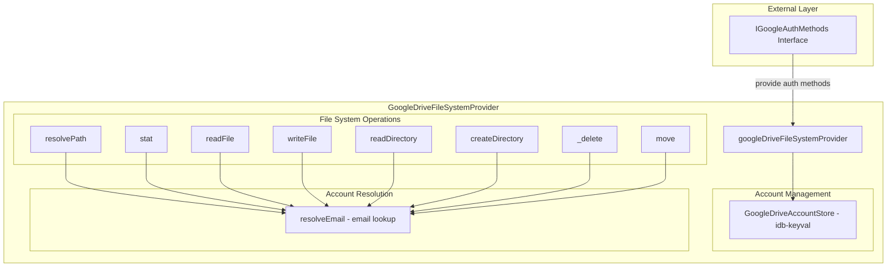
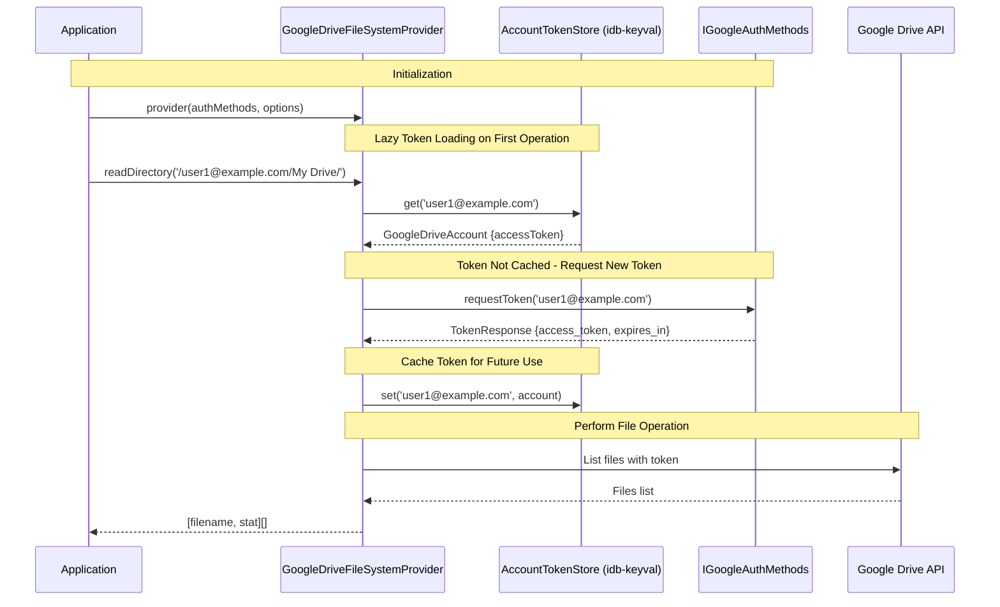

# Multi-Account Google Drive File System Provider

## Feature Goal and Business Context

**Цель:** Рефакторинг `GoogleDriveFileSystemProvider` для поддержки многопользовательской аутентификации с хранением токенов через `idb-keyval`.

**Бизнес-контекст:** Приложение позволяет пользователям работать с несколькими аккаунтами Google Drive одновременно. Каждый пользователь должен иметь свой корневой каталог в виртуальной файловой системе, содержащий все три пространства Google Drive:

1. **My Drive** (основное пространство)
2. **Shared with me** (файлы, на которые выделено доступ)
3. **App Data Folder** (скрытое пространство для служебных данных приложения)

## Functional Requirements

### FR-1: Внешнее предоставление методов аутентификации

Провайдер должен принимать интерфейс с методами аутентификации извне, а не создавать их внутри.

### FR-2: Хранение токенов через idb-keyval

**Ключ:** `google_drive_accounts` (провайдер имеет свой собственный ключ в IndexedDB)

**Структура данных внутри хранилища:** Record<string, GoogleDriveAccount>, где ключи — это email пользователей.

```typescript
{
  "user1@example.com": {
    accessToken: "ya29.a0AfH6SMB...",  // Access token для этого аккаунта
    expiresAt: 1711328400000,          // Время истечения токена (timestamp в ms)
    scopes: ["drive", "appdatafolder"] // Полученные при авторизации
  },
  "user2@example.com": {
    accessToken: "ya29.a0AfH6SMB...",
    expiresAt: 1711328350000,
    scopes: ["drive"]
  }
}
```

**Методы GoogleDriveAccountStore:** get/set/remove/list/has/clear — все операции работают с ключом `google_drive_accounts`, внутри хранилища используются email как ключи для доступа к аккаунтам. Все методы должны быть стрелочными функциями без привязки к контексту (`this`).

### FR-3: Структура файловой системы

```
/ (root)
├── user1@example.com/          # Корневая директория аккаунта 1
│   ├── My Drive/               # Пространство "Мой диск"
│   ├── Shared with me/         # Пространство "Общие со мной"
│   └── App Data Folder/        # Скрытое пространство
├── user2@example.com/          # Корневая директория аккаунта 2
│   ├── My Drive/
│   ├── Shared with me/
│   └── App Data Folder/
```

### FR-4: Управление аккаунтами

Провайдер должен поддерживать:

- Добавление новых аккаунтов через `addAccount()`
- Навигацию по файловой системе (корневые директории с email-именами, каждая содержит все три пространства Google Drive)
- Удаление аккаунтов через `removeAccount()`
- Получение списка доступных аккаунтов через `listAccounts()`

**Методы управления аккаунтами:**

- `addAccount()` — запускает процесс авторизации через IGoogleAuthMethods (запрашивает токен и email у пользователя), затем сохраняет аккаунт в хранилище. При чтении корневой директории система динамически представляет сохранённые аккаунты в виде директорий
- `removeAccount(email)` — удаляет аккаунт по ключу (email) из хранилища
- `listAccounts()` — возвращает массив email-ов всех доступных аккаунтов

## Proposed Solution (Abstract Component Architecture)

### Component Diagram



### Data Flow Diagram



**Примечание:** Переменная `account` содержит `{accessToken, expiresAt, scopes}`.

## Potential Risks and Trade-offs

### Risk 1: Token Expiration Handling (без refresh token)

**Проблема:** Токены Google Drive имеют срок действия (`expires_in` секунд), но нет refresh token. При истечении токена нужно перезапускать полный процесс авторизации.

**Решение:**

1. При сохранении токена вычислять `expiresAt = Date.now() + (expires_in * 1000)`
2. Перед каждой операцией проверять, не истёк ли токен (с запасом 5 минут)
3. Если токен истёк — запрашивать авторизацию заново с email для идентификации аккаунта и обновлять аккаунт в хранилище

**Примечание:** Все аккаунты должны иметь email для идентификации, так как Google Drive OAuth2 возвращает email пользователя после успешной авторизации.

### Risk 3: Производительность idb-keyval

**Проблема:** Частые операции чтения/записи токенов могут замедлять работу.

**Решение:**

- Кэширование токенов в Map (память приложения) после загрузки из IndexedDB
- Асинхронная загрузка при инициализации провайдера
- Lazy loading токенов только при необходимости

### Risk 4: Безопасность токенов

**Проблема:** Токены хранятся в IndexedDB, но это не критично, т.к. токены живут всего час (short-lived access tokens).

**Решение:**

- Ограничить доступ к провайдеру через TypeScript типы
- Реализовать logout для очистки токенов при выходе пользователя

## Implementation Plan

### Phase 1: Типы и интерфейсы

```typescript
// src/shared/lib/googleDrive/types.ts

import type { google } from "google.accounts.oauth2";

export interface IGoogleAuthMethods {
  /**
   * Запрашивает токен доступа для аккаунта по email.
   * @param email - Email известного аккаунта. Если не указан, создаётся новый аккаунт.
   * @returns Promise<TokenResponse> - Объект с токеном и метаданными (google.accounts.oauth2.TokenResponse)
   */
  requestToken: (
    email?: string,
  ) => Promise<google.accounts.oauth2.TokenResponse>;

  /**
   * Получает информацию о владельце токена по access_token.
   * @param accessToken - Access token аккаунта для которого нужно получить инфо
   * @returns Promise<UserInfo> - Информация о пользователе (gapi.client.oauth2.Userinfo)
   */
  getUserInfo: (accessToken: string) => Promise<gapi.client.oauth2.Userinfo>;
}

// Внутренний интерфейс провайдера для работы с хранилищем токенов
export interface GoogleDriveAccountStore {
  /**
   * Получает аккаунт по email.
   */
  get: (email: string) => Promise<GoogleDriveAccount | null>;

  /**
   * Сохраняет или обновляет аккаунт.
   */
  set: (email: string, account: GoogleDriveAccount) => Promise<void>;

  /**
   * Удаляет аккаунт и его данные.
   */
  remove: (email: string) => Promise<void>;

  /**
   * Получает список всех сохраненных аккаунтов (для easy extraction).
   * Возвращает массив email-ов для быстрого перебора.
   */
  list: () => Promise<string[]>;

  /**
   * Проверяет, существует ли аккаунт.
   */
  has: (email: string) => Promise<boolean>;

  /**
   * Очищает все данные (для logout).
   */
  clear: () => Promise<void>;
}

export interface GoogleDriveAccount {
  accessToken: string; // OAuth2 access token
  expiresAt: number; // Timestamp в ms, когда токен истекает (обязательно после успешной авторизации)
  scopes: string[]; // Список разрешений, полученных при авторизации
}
```

### Phase 2: Account Token Store (Ленивая загрузка)

- [ ] Реализовать `GoogleDriveAccountStore` на базе `idb-keyval` с ключом `google_drive_accounts`
- [ ] Методы: `get`, `set`, `remove`, `list`, `has`, `clear`

### Phase 3: Рефакторинг GoogleDriveFileSystemProvider

```typescript
import type { IFileSystemProvider } from '../virtualFileSystem';

export interface GoogleDriveFileSystemProvider extends IFileSystemProvider {
  /**
   * Добавляет новый аккаунт и запрашивает токен для него.
   * После добавления директория аккаунта будет доступна в корне провайдера по email-префиксу.
   */
  addAccount: () => Promise<void>;

  /**
   * Удаляет аккаунт по ключу (email) из хранилища.
   */
  removeAccount: (email: string) => Promise<void>;

  /**
   * Получает список всех добавленных аккаунтов (email-ов).
   */
  listAccounts: () => Promise<string[]>;
}

export const googleDriveFileSystemProvider = (
  authMethods: IGoogleAuthMethods,
): GoogleDriveFileSystemProvider;
```

**Примечание:** Все методы провайдера должны быть стрелочными функциями без привязки к контексту (`this`), так как они могут вызываться из асинхронных операций (fetch, event listeners).

- [ ] Изменить сигнатуру провайдера для приема `IGoogleAuthMethods` при инициализации
- [ ] Добавить методы управления аккаунтами (addAccount, removeAccount, listAccounts)
- [ ] Обновить все операции с поддержкой email-путей

### Phase 4: Интеграция

- [ ] Обновить все места использования провайдера в коде (`src/shared/service/google/useGoogleService.ts`)
- [ ] Обновить экспорты в `src/shared/lib/googleDrive/index.ts`

## Changes in Data Structure

### Account Token Storage Schema (idb-keyval)

**Key:** `google_drive_accounts`

**Value Type:** Record<string, GoogleDriveAccount>

```typescript
{
  "user1@example.com": {
    accessToken: "ya29.a0AfH6SMB...",  // Access token для этого аккаунта
    expiresAt: 1711328400000,          // Время истечения токена (timestamp в ms)
    scopes: ["drive", "appdatafolder"] // Полученные при авторизации
  },
  "user2@example.com": {
    accessToken: "ya29.a0AfH6SMB...",
    expiresAt: 1711328350000,
    scopes: ["drive"]
  }
}
```

### Virtual File System Structure

**Root (`/`):**

- Directory entries representing user accounts (email addresses)

**Account Root (`/{email}/`):**

- `My Drive/` - ID: `root` or account-specific root
- `Shared with me/` - ID: `sharedWithMe` or account-specific shared folder
- `App Data Folder/` - ID: `appDataFolder` or account-specific app data

### Benefits of Separate Key and Structure

1. **Изоляция данных:** Провайдер имеет собственное хранилище токенов в IndexedDB
2. **Удобное извлечение списка:** Метод `list()` возвращает массив email-ов для быстрого перебора
3. **Расширяемость:** Можно добавлять дополнительные метаданные без изменения ключа хранения
4. **Контроль миграции:** Провайдер может самостоятельно мигрировать данные при обновлении структуры

## Deployment Strategy

### Migration Plan

1. **Phase 1:** Добавить новые типы и интерфейсы без изменения существующего кода
2. **Phase 2:** Реализовать `GoogleDriveAccountStore` отдельно от провайдера
3. **Phase 3:** Обновить `GoogleDriveFileSystemProvider` для использования нового хранилища
4. **Phase 4:** Обновить все места использования провайдера в коде

### Backward Compatibility

- Старый интерфейс с параметром `auth: GoogleAuthParams` может быть удален
- Новые методы управления аккаунтами добавляются как опциональные
- Существующие операции файловой системы сохраняют ту же сигнатуру

### getUserInfo Usage

Метод `getUserInfo(accessToken)` используется для получения информации о пользователе (email, имя) при необходимости. Однако email уже возвращается в `TokenResponse` от Google OAuth2 API после успешной авторизации, поэтому отдельный вызов `getUserInfo` не требуется для идентификации аккаунта при создании.
